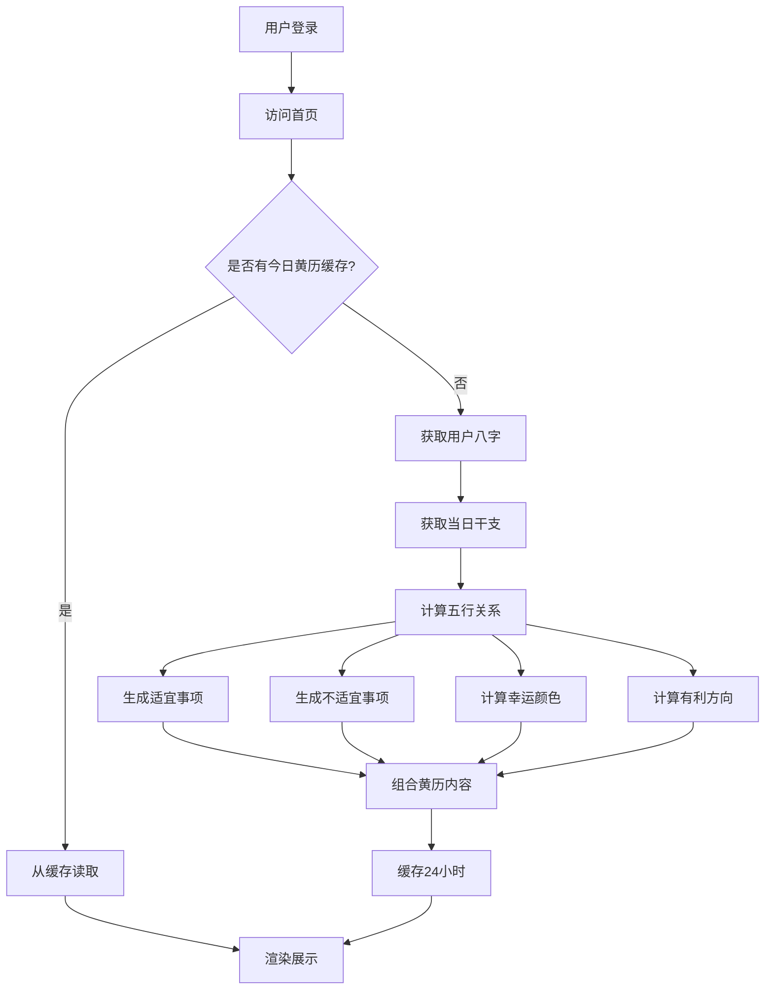
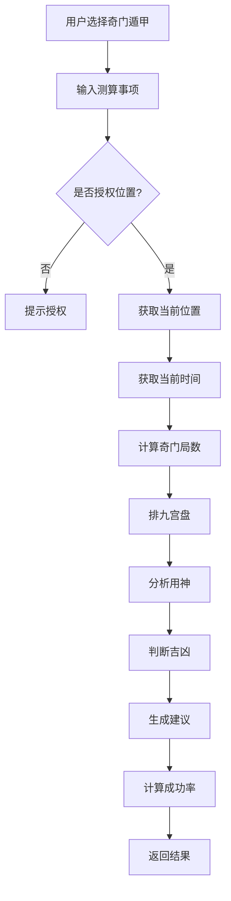
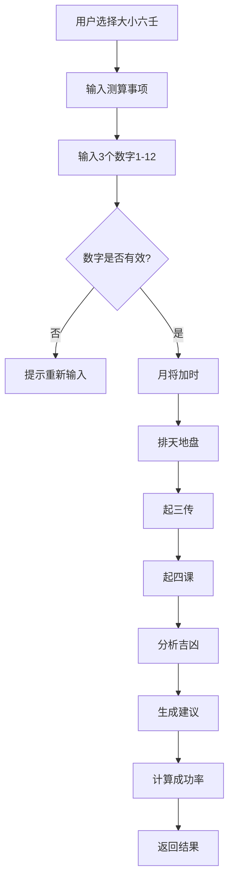
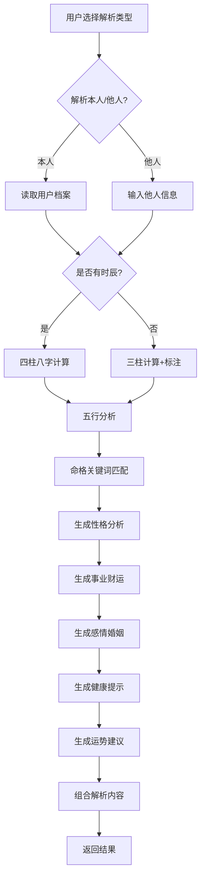

# 命理测算工具 - 功能规格说明

> 文档编号: 06  
> 版本: V1.0  
> 日期: 2026-04-15  
> 作者: AI Spec Generator  
> 状态: 待审核

---

## 目录

- [1. 个性化黄历日历功能](#1-个性化黄历日历功能)
- [2. 针对性运势问询功能](#2-针对性运势问询功能)
- [3. 静态命格解析功能](#3-静态命格解析功能)
- [4. 异常处理规范](#4-异常处理规范)

---

## 1. 个性化黄历日历功能

### 1.1 功能概述

基于用户八字信息结合当日日期,自动生成专属个性化黄历内容,包括适宜/不适宜事项、幸运颜色、有利方向。

### 1.2 业务流程图



### 1.3 交互逻辑

#### 1.3.1 首页展示逻辑

**页面加载流程**:
1. 用户访问首页(`/`)
2. 系统检查用户登录状态
   - 未登录: 跳转到登录页
   - 已登录: 继续加载
3. 检查今日黄历缓存
   - 缓存存在: 直接读取缓存数据
   - 缓存不存在: 调用算法引擎计算
4. 渲染黄历卡片组件

**黄历卡片组件结构**:
```
┌─────────────────────────────────┐
│ 📅 2026年4月15日 星期三          │
│    农历三月初八 丙午年壬辰月      │
├─────────────────────────────────┤
│ ✅ 适宜事项                      │
│ · 签约合作                       │
│ · 出行拜访                       │
│ · 面试求职                       │
├─────────────────────────────────┤
│ ❌ 不适宜事项                    │
│ · 动土装修                       │
│ · 大额借贷                       │
├─────────────────────────────────┤
│ 🎨 幸运颜色: 红色、黄色           │
│ 🧭 有利方向: 正东、东南           │
└─────────────────────────────────┘
```

#### 1.3.2 日期切换逻辑

**操作方式**:
- PC端: 点击左右箭头按钮
- 移动端: 左右滑动手势

**限制规则**:
- 支持查看范围: 前后7天
- 超出范围时箭头按钮禁用
- 切换日期时显示加载动画(250ms)

### 1.4 算法逻辑

#### 1.4.1 适宜/不适宜事项生成

**输入**:
- 用户八字(年柱、月柱、日柱、时柱)
- 当日干支

**处理逻辑**:
```
1. 计算用户八字五行强弱
2. 计算当日干支五行属性
3. 分析五行生克关系:
   - 生我者为吉(适宜)
   - 克我者为凶(不适宜)
   - 我生者为泄(慎用)
   - 我克者为财(适宜)
   - 同我者为助(适宜)
4. 根据吉凶属性匹配事项库
5. 筛选3-5条适宜事项,2-3条不适宜事项
```

**事项库示例**:
```javascript
const suitableItems = {
  '木': ['签约合作', '出行拜访', '面试求职', '学习交流'],
  '火': ['开业庆典', '表白求婚', '投资理财', '社交聚会'],
  '土': ['购房置业', '团队建设', '健康养生', '家庭聚会'],
  '金': ['法律事务', '财务管理', '精密工作', '决策规划'],
  '水': ['创意灵感', '艺术创作', '旅行探索', '情感沟通']
}
```

#### 1.4.2 幸运颜色计算

**五行对应颜色**:
```javascript
const colorMap = {
  '木': ['绿色', '青色'],
  '火': ['红色', '紫色'],
  '土': ['黄色', '棕色'],
  '金': ['白色', '金色'],
  '水': ['黑色', '蓝色']
}
```

**计算逻辑**:
1. 找出当日对用户最有利的五行属性
2. 从colorMap中获取对应颜色
3. 返回1-2种幸运颜色

#### 1.4.3 有利方向计算

**五行对应方向**:
```javascript
const directionMap = {
  '木': ['正东'],
  '火': ['正南'],
  '土': ['中央', '东北', '西南'],
  '金': ['正西', '西北'],
  '水': ['正北']
}
```

---

## 2. 针对性运势问询功能

### 2.1 功能概述

支持奇门遁甲和大小六壬两种起卦方式,为用户特定事件决策提供专业建议。

### 2.2 奇门遁甲起卦流程



### 2.3 奇门遁甲算法逻辑

#### 2.3.1 起局计算

**输入**:
- 当前时间(年、月、日、时)
- 用户位置(经度、纬度)

**计算步骤**:
```
1. 确定阴阳遁:
   - 冬至后到夏至前: 阳遁
   - 夏至后到冬至前: 阴遁

2. 确定局数(1-9局):
   - 根据日干支和节气查表

3. 排地盘三奇六仪:
   - 戊己庚辛壬癸丁丙乙(阳遁顺排)
   - 戊乙丙丁壬癸辛庚己(阴遁逆排)

4. 排天盘九星:
   - 蓬芮冲辅禽心柱任英

5. 排八门:
   - 休生伤杜景死惊开

6. 排八神:
   - 值符腾蛇太阴六合白虎玄武九地九天

7. 确定值符值使:
   - 根据时旬首确定
```

#### 2.3.2 吉凶判断

**分析逻辑**:
```javascript
function analyzeQimen(question, palace) {
  // 1. 确定用神(根据事项类型)
  const yongshen = determineYongshen(question)
  
  // 2. 分析用神落宫
  const palaceInfo = getPalaceInfo(palace, yongshen)
  
  // 3. 综合判断:
  //    - 吉门+吉星+吉神 = 大吉
  //    - 吉门+吉星 = 吉
  //    - 吉门 = 小吉
  //    - 凶门+凶星 = 凶
  
  // 4. 计算成功率(0-100%)
  const successRate = calculateSuccessRate(palaceInfo)
  
  // 5. 生成建议文本
  const advice = generateAdvice(palaceInfo, question)
  
  return { successRate, advice, palaceInfo }
}
```

### 2.4 大小六壬起卦流程



### 2.5 大小六壬算法逻辑

#### 2.5.1 起课计算

**输入**:
- 3个数字(范围1-12)
- 当前月将
- 当前时辰

**计算步骤**:
```
1. 地支对应数字:
   1=子 2=丑 3=寅 4=卯 5=辰 6=巳
   7=午 8=未 9=申 10=酉 11=戌 12=亥

2. 月将加时:
   - 月将加在时辰地支上
   - 顺排十二地支得天盘

3. 起四课:
   - 第一课:日干上神
   - 第二课:日支上神
   - 第三课:日干阴神
   - 第四课:日支阴神

4. 起三传:
   - 初传:贼克取用
   - 中传:初传上神
   - 末传:中传上神

5. 分析三传四课:
   - 吉神:青龙、太常、天后
   - 凶神:白虎、玄武、螣蛇
   - 结合十二天将判断
```

### 2.6 交互逻辑

#### 2.6.1 起卦表单

**奇门遁甲表单**:
```
┌─────────────────────────────────┐
│ 🔮 奇门遁甲起卦                  │
├─────────────────────────────────┤
│ 测算事项:                        │
│ ┌─────────────────────────────┐ │
│ │ 请输入您要测算的具体事项...   │ │
│ └─────────────────────────────┘ │
│                                  │
│ 📍 需要授权您的位置信息          │
│ [授权位置]                       │
│                                  │
│ ℹ️ 今日剩余次数: 1次             │
│                                  │
│          [开始起卦]               │
└─────────────────────────────────┘
```

**大小六壬表单**:
```
┌─────────────────────────────────┐
│ 🔮 大小六壬起卦                  │
├─────────────────────────────────┤
│ 测算事项:                        │
│ ┌─────────────────────────────┐ │
│ │ 请输入您要测算的具体事项...   │ │
│ └─────────────────────────────┘ │
│                                  │
│ 请输入3个数字(1-12):             │
│ ┌───┐ ┌───┐ ┌───┐               │
│ │ 5 │ │ 8 │ │ 2 │               │
│ └───┘ └───┘ └───┘               │
│                                  │
│ ℹ️ 今日剩余次数: 3次             │
│                                  │
│          [开始起卦]               │
└─────────────────────────────────┘
```

---

## 3. 静态命格解析功能

### 3.1 功能概述

基于用户出生信息,深度解析个人命格特征,输出关键词和全方位分析内容。

### 3.2 业务流程图



### 3.3 命格关键词匹配逻辑

**关键词库示例**:
```javascript
const destinyKeywords = {
  '高楼望月': {
    condition: '日主弱,印星旺',
    description: '性格温和,善于思考,适合从事文化、教育、研究工作'
  },
  '龙腾四海': {
    condition: '日主旺,食伤生财',
    description: '事业心强,有领导才能,适合创业或管理工作'
  },
  '桃花运旺': {
    condition: '八字桃花星多',
    description: '异性缘佳,感情丰富,需注意感情纠纷'
  }
}
```

**匹配算法**:
```javascript
function matchDestinyKeywords(bazi) {
  const keywords = []
  
  // 1. 分析日主强弱
  const dayMasterStrength = analyzeDayMaster(bazi)
  
  // 2. 分析十神关系
  const shishen = analyzeShishen(bazi)
  
  // 3. 匹配关键词
  for (const [keyword, rule] of Object.entries(destinyKeywords)) {
    if (evaluateCondition(rule.condition, bazi, dayMasterStrength, shishen)) {
      keywords.push({ keyword, description: rule.description })
    }
  }
  
  // 4. 返回1-3个最匹配的关键词
  return keywords.slice(0, 3)
}
```

### 3.4 解析内容生成

#### 3.4.1 五行分析

**输出格式**:
```
五行分布:
金: ████░░░░░░ 40%
木: ██░░░░░░░░ 20%
水: ███░░░░░░░ 30%
火: █░░░░░░░░░ 10%
土: ░░░░░░░░░░ 0%

五行分析:
您的八字金旺水相,木弱火缺。金主义气,为人正直刚强;
水主智慧,思维敏捷。建议补火土,可佩戴红色饰品,多接触大自然。
```

#### 3.4.2 性格特征分析

**模板结构**:
```
根据您的命格分析,您的性格特征如下:

优点:
· 性格特征1 (基于十神分析)
· 性格特征2 (基于五行分析)
· 性格特征3 (基于日主分析)

缺点:
· 需要注意的性格盲点1
· 需要注意的性格盲点2

建议:
性格改善和发挥优势的建议
```

### 3.5 交互逻辑

**解析表单**:
```
┌─────────────────────────────────┐
│ 📜 命格解析                      │
├─────────────────────────────────┤
│ 解析类型:                        │
│ ○ 解析本人  ○ 解析他人           │
├─────────────────────────────────┤
│ 姓名:                            │
│ ┌─────────────────────────────┐ │
│ │                              │ │
│ └─────────────────────────────┘ │
│                                  │
│ 性别:                            │
│ ○ 男  ○ 女                       │
│                                  │
│ 出生日期:                        │
│ ┌──────┐ ┌────┐ ┌────┐          │
│ │ 1990 │年│ 05 │月│ 15 │日      │
│ └──────┘ └────┘ └────┘          │
│                                  │
│ 出生时辰:                        │
│ ┌─────────────────────────────┐ │
│ │ 选择时辰                     │ │
│ └─────────────────────────────┘ │
│ □ 不清楚具体时辰                 │
│                                  │
│          [开始解析]               │
└─────────────────────────────────┘
```

---

## 4. 异常处理规范

### 4.1 网络异常

| 异常类型 | 处理策略 | 用户提示 |
|---------|---------|---------|
| 请求超时 | 重试2次,间隔1秒 | "网络请求超时,请检查网络连接" |
| 网络断开 | 显示离线页面 | "网络连接已断开,请检查后重试" |
| 服务器错误(5xx) | 显示错误页面 | "服务器异常,请稍后重试" |
| 客户端错误(4xx) | 根据错误码处理 | 具体错误提示 |

### 4.2 数据异常

| 异常类型 | 处理策略 | 用户提示 |
|---------|---------|---------|
| 八字计算失败 | 使用备用算法库 | "计算出现异常,请检查出生信息" |
| 缓存失效 | 重新计算 | 静默处理,用户无感知 |
| 数据库连接失败 | 重试3次 | "系统繁忙,请稍后重试" |

### 4.3 用户输入异常

| 异常类型 | 处理策略 | 用户提示 |
|---------|---------|---------|
| 日期格式错误 | 前端校验拦截 | "请输入正确的日期格式" |
| 日期超出范围 | 前端校验拦截 | "仅支持1900-2100年的日期" |
| 数字范围错误 | 前端校验拦截 | "请输入1-12之间的数字" |
| 必填项为空 | 前端校验拦截 | "请填写完整信息" |

### 4.4 权限异常

| 异常类型 | 处理策略 | 用户提示 |
|---------|---------|---------|
| Token过期 | 跳转登录页 | "登录已过期,请重新登录" |
| 未授权访问 | 拦截请求 | "请先登录后再使用" |
| 位置授权拒绝 | 降级处理 | "奇门遁甲需要位置信息,请授权后重试" |

---

## 文档审批

| 角色 | 姓名 | 签字 | 日期 |
|------|------|------|------|
| 产品负责人 | | | |
| 技术负责人 | | | |

---

**文档结束**
