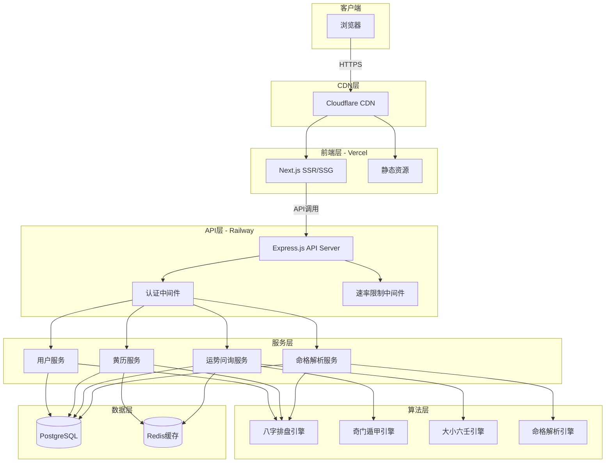
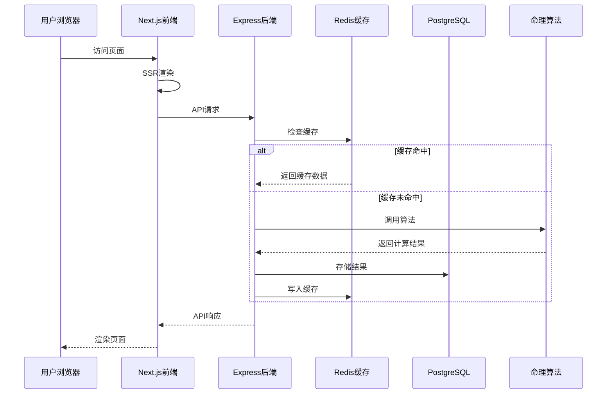
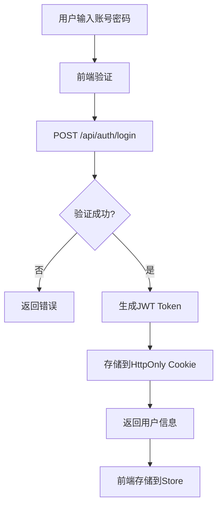
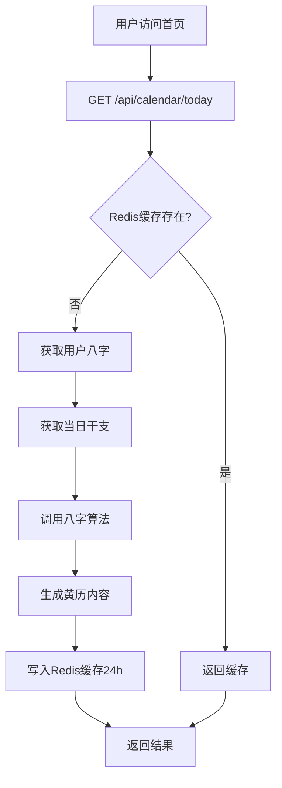
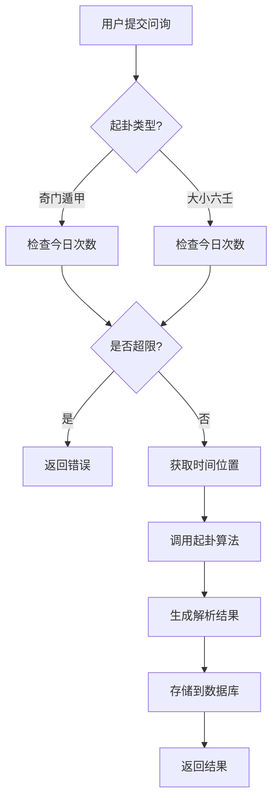
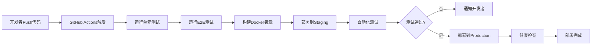

# 命理测算工具 - 系统架构与技术选型

> 文档编号: 08  
> 版本: V1.0  
> 日期: 2026-04-15  
> 作者: AI Spec Generator  
> 状态: 待审核

---

## 目录

- [1. 系统架构概述](#1-系统架构概述)
- [2. 技术栈选型](#2-技术栈选型)
- [3. 系统架构图](#3-系统架构图)
- [4. 组件设计](#4-组件设计)
- [5. 数据流设计](#5-数据流设计)
- [6. 部署架构](#6-部署架构)

---

## 1. 系统架构概述

### 1.1 架构风格

采用**前后端分离的RESTful架构**,结合Next.js的SSR/SSG能力优化SEO和首屏性能。

**架构特点**:
- 前后端独立部署和扩展
- RESTful API标准化接口
- Next.js服务端渲染提升性能
- 云原生部署降低运维成本

### 1.2 架构原则

- **模块化**: 命理算法独立封装,便于测试和维护
- **无状态**: API无状态设计,支持水平扩展
- **缓存优先**: 热点数据Redis缓存,减少数据库压力
- **安全第一**: HTTPS强制、JWT认证、数据加密

---

## 2. 技术栈选型

### 2.1 前端技术栈

| 技术 | 版本 | 用途 | 选择理由 |
|------|------|------|---------|
| Next.js | 14+ | React框架 | SSR/SSG支持、路由系统、API Routes |
| React | 18+ | UI库 | 组件化、生态丰富、社区活跃 |
| TypeScript | 5+ | 类型系统 | 类型安全、开发效率、代码质量 |
| Tailwind CSS | 3+ | 样式框架 | 原子化CSS、响应式、定制性强 |
| Zustand | 4+ | 状态管理 | 轻量级、简单易用、TypeScript友好 |
| Axios | 1.x | HTTP客户端 | 拦截器、类型安全、错误处理 |
| ECharts | 5.x | 图表库 | 卦象可视化、功能强大 |
| React Hook Form | 7.x | 表单管理 | 性能优秀、验证方便 |
| Zod | 3.x | 数据验证 | TypeScript优先、 schema验证 |

### 2.2 后端技术栈

| 技术 | 版本 | 用途 | 选择理由 |
|------|------|------|---------|
| Node.js | 18+ | 运行时环境 | 高性能、生态丰富、前后端统一语言 |
| Express.js | 4+ | Web框架 | 轻量级、中间件生态、简单易用 |
| TypeScript | 5+ | 类型系统 | 类型安全、开发效率 |
| Prisma | 5+ | ORM | 类型安全、迁移工具、查询构建器 |
| jsonwebtoken | 9.x | JWT认证 | 标准实现、简单易用 |
| bcrypt | 5.x | 密码加密 | 安全性高、业界标准 |
| Redis | 4.x | 缓存 | 高性能、数据结构丰富 |
| winston | 3.x | 日志 | 可扩展、格式灵活 |

### 2.3 数据库与存储

| 技术 | 版本 | 用途 | 选择理由 |
|------|------|------|---------|
| PostgreSQL | 14+ | 主数据库 | 关系型、ACID、JSON支持 |
| Redis | 7+ | 缓存层 | 高性能、支持复杂数据结构 |

### 2.4 部署与运维

| 技术 | 用途 | 选择理由 |
|------|------|---------|
| Vercel | 前端部署 | Next.js官方支持、自动CI/CD、全球CDN |
| Railway | 后端+数据库部署 | 简单易用、自动扩缩容、PostgreSQL托管 |
| GitHub Actions | CI/CD | 代码仓库集成、免费额度充足 |
| Cloudflare | DNS+CDN | 免费DDoS防护、全球节点 |
| Sentry | 错误监控 | 实时错误追踪、堆栈分析 |

---

## 3. 系统架构图

### 3.1 整体架构图



### 3.2 数据流图



---

## 4. 组件设计

### 4.1 前端组件架构

```
src/
├── components/          # 可复用组件
│   ├── ui/             # 基础UI组件
│   │   ├── Button.tsx
│   │   ├── Input.tsx
│   │   ├── Card.tsx
│   │   └── Modal.tsx
│   ├── layout/         # 布局组件
│   │   ├── Header.tsx
│   │   ├── Footer.tsx
│   │   └── Sidebar.tsx
│   └── business/       # 业务组件
│       ├── CalendarCard.tsx
│       ├── DivinationForm.tsx
│       ├── DestinyResult.tsx
│       └── GuaVisualization.tsx
├── pages/              # 页面组件
│   ├── index.tsx       # 首页(黄历)
│   ├── login.tsx       # 登录页
│   ├── profile.tsx     # 个人档案
│   ├── divination.tsx  # 运势问询
│   └── destiny.tsx     # 命格解析
├── hooks/              # 自定义Hooks
│   ├── useAuth.ts
│   ├── useCalendar.ts
│   └── useDivination.ts
├── store/              # 状态管理
│   ├── authStore.ts
│   └── userStore.ts
├── services/           # API服务
│   ├── auth.ts
│   ├── calendar.ts
│   ├── divination.ts
│   └── destiny.ts
├── utils/              # 工具函数
│   ├── validator.ts
│   └── formatter.ts
└── styles/             # 全局样式
    └── globals.css
```

### 4.2 后端组件架构

```
src/
├── controllers/        # 控制器
│   ├── authController.ts
│   ├── calendarController.ts
│   ├── divinationController.ts
│   └── destinyController.ts
├── services/           # 业务逻辑
│   ├── authService.ts
│   ├── calendarService.ts
│   ├── divinationService.ts
│   └── destinyService.ts
├── algorithms/         # 命理算法
│   ├── bazi/          # 八字排盘
│   │   ├── calculator.ts
│   │   └── analyzer.ts
│   ├── qimen/         # 奇门遁甲
│   │   ├── calculator.ts
│   │   └── interpreter.ts
│   ├── liuren/        # 大小六壬
│   │   ├── calculator.ts
│   │   └── interpreter.ts
│   └── destiny/       # 命格解析
│       ├── calculator.ts
│       └── generator.ts
├── middleware/         # 中间件
│   ├── auth.ts
│   ├── rateLimiter.ts
│   └── errorHandler.ts
├── routes/            # 路由
│   ├── auth.ts
│   ├── calendar.ts
│   ├── divination.ts
│   └── destiny.ts
├── models/            # 数据模型(Prisma)
│   └── schema.prisma
├── utils/             # 工具函数
│   ├── logger.ts
│   ├── encryption.ts
│   └── validator.ts
└── config/            # 配置文件
    └── database.ts
```

### 4.3 命理算法模块设计

#### 4.3.1 八字排盘引擎

```typescript
interface BaziCalculator {
  // 公历转农历
  solarToLunar(year: number, month: number, day: number): LunarDate
  
  // 计算四柱
  calculatePillars(lunarDate: LunarDate, hour: number): FourPillars
  
  // 分析五行
  analyzeWuxing(pillars: FourPillars): WuxingDistribution
  
  // 分析十神
  analyzeShishen(pillars: FourPillars): ShishenMap
}
```

#### 4.3.2 奇门遁甲引擎

```typescript
interface QimenCalculator {
  // 起局计算
  calculateJu(dateTime: DateTime, location: Location): QimenJu
  
  // 排盘
  arrangePalace(ju: QimenJu): QimenPalace
  
  // 吉凶分析
  analyze(palace: QimenPalace, question: string): QimenAnalysis
}
```

#### 4.3.3 大小六壬引擎

```typescript
interface LiurenCalculator {
  // 起课计算
  calculateCourse(numbers: number[], monthGeneral: number, hour: number): LiurenCourse
  
  // 排盘
  arrangePalace(course: LiurenCourse): LiurenPalace
  
  // 吉凶分析
  analyze(palace: LiurenPalace, question: string): LiurenAnalysis
}
```

---

## 5. 数据流设计

### 5.1 用户认证流程



### 5.2 黄历查询流程



### 5.3 运势问询流程



---

## 6. 部署架构

### 6.1 环境配置

| 环境 | 用途 | 域名 | 部署方式 |
|------|------|------|---------|
| Development | 本地开发 | localhost | npm run dev |
| Staging | 测试环境 | staging.xxx.com | push到develop分支 |
| Production | 生产环境 | www.xxx.com | push到main分支 |

### 6.2 前端部署(Vercel)

```yaml
# vercel.json
{
  "buildCommand": "npm run build",
  "devCommand": "npm run dev",
  "installCommand": "npm install",
  "framework": "nextjs",
  "outputDirectory": ".next",
  "regions": ["hkg1"],  // 香港节点
  "env": {
    "NEXT_PUBLIC_API_URL": "https://api.xxx.com"
  }
}
```

### 6.3 后端部署(Railway)

```yaml
# railway.toml
[build]
builder = "NIXPACKS"

[deploy]
startCommand = "npm start"
healthcheckPath = "/api/health"
restartPolicyType = "ON_FAILURE"
```

### 6.4 数据库配置

**PostgreSQL(Railway托管)**:
```
数据库版本: PostgreSQL 14
连接池: PgBouncer
自动备份: 每日
存储加密: 是
```

**Redis(Upstash)**:
```
版本: Redis 7
持久化: AOF + RDB
最大内存: 256MB
```

### 6.5 CI/CD流程



### 6.6 监控与告警

**监控栈**:
```
前端监控: Vercel Analytics + Sentry
后端监控: Railway Metrics + Sentry
数据库监控: Railway Dashboard
Uptime监控: UptimeRobot(5分钟检查)
日志系统: Railway Logs + Sentry
```

**告警通知**:
```
P0告警(短信+邮件):
  - 服务不可用
  - 错误率>5%
  
P1告警(邮件):
  - 响应时间>2s
  - CPU使用率>80%
  - 磁盘使用率>85%
```

---

## 文档审批

| 角色 | 姓名 | 签字 | 日期 |
|------|------|------|------|
| 架构师 | | | |
| 技术负责人 | | | |
| 运维负责人 | | | |

---

**文档结束**
