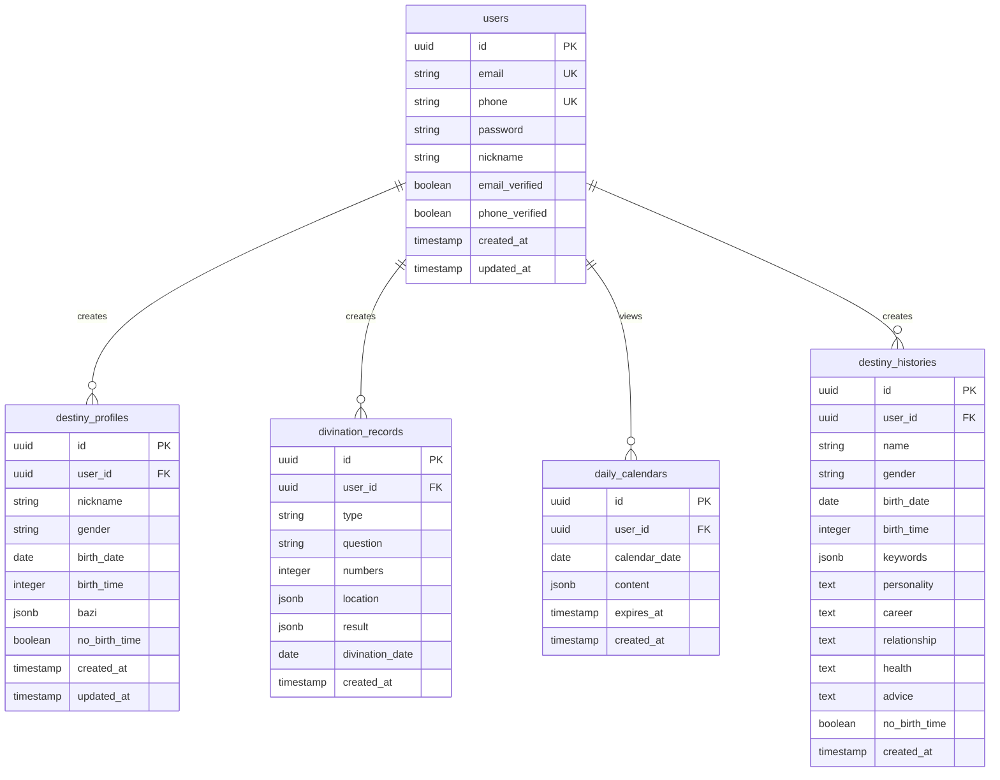

# 命理测算工具 - 数据模型与存储规格

> 文档编号: 10  
> 版本: V1.0  
> 日期: 2026-04-15  
> 作者: AI Spec Generator  
> 状态: 待审核

---

## 目录

- [1. 数据库设计概述](#1-数据库设计概述)
- [2. 实体关系图](#2-实体关系图)
- [3. 数据表定义](#3-数据表定义)
- [4. Prisma Schema](#4-prisma-schema)
- [5. 索引设计](#5-索引设计)
- [6. 数据迁移策略](#6-数据迁移策略)

---

## 1. 数据库设计概述

### 1.1 数据库选型

**主数据库**: PostgreSQL 14+
- 关系型数据库,支持ACID事务
- JSON字段支持灵活数据存储
- 丰富的数据类型和函数
- 强大的查询优化器

**缓存数据库**: Redis 7+
- 黄历缓存(24小时TTL)
- 会话存储
- 速率限制计数

### 1.2 设计原则

- 第三范式(3NF)减少数据冗余
- 适当反范式化提升查询性能
- 软删除保留历史数据
- 审计字段追踪数据变更

---

## 2. 实体关系图



---

## 3. 数据表定义

### 3.1 users表

| 字段名 | 类型 | 必填 | 默认值 | 说明 |
|--------|------|------|--------|------|
| id | UUID | 是 | gen_random_uuid() | 主键 |
| email | VARCHAR(255) | 否 | NULL | 邮箱(唯一) |
| phone | VARCHAR(20) | 否 | NULL | 手机号(唯一) |
| password | VARCHAR(255) | 是 | - | bcrypt哈希密码 |
| nickname | VARCHAR(50) | 是 | - | 昵称 |
| email_verified | BOOLEAN | 是 | false | 邮箱是否验证 |
| phone_verified | BOOLEAN | 是 | false | 手机是否验证 |
| created_at | TIMESTAMP | 是 | NOW() | 创建时间 |
| updated_at | TIMESTAMP | 是 | NOW() | 更新时间 |

**约束**:
- PRIMARY KEY (id)
- UNIQUE (email)
- UNIQUE (phone)
- CHECK (email IS NOT NULL OR phone IS NOT NULL)

**索引**:
- idx_users_email: email
- idx_users_phone: phone

---

### 3.2 destiny_profiles表

| 字段名 | 类型 | 必填 | 默认值 | 说明 |
|--------|------|------|--------|------|
| id | UUID | 是 | gen_random_uuid() | 主键 |
| user_id | UUID | 是 | - | 用户ID(外键) |
| nickname | VARCHAR(50) | 是 | - | 姓名 |
| gender | VARCHAR(10) | 是 | - | 性别(male/female) |
| birth_date | DATE | 是 | - | 出生日期 |
| birth_time | INTEGER | 否 | NULL | 出生时辰(0-23) |
| bazi | JSONB | 是 | - | 八字信息 |
| no_birth_time | BOOLEAN | 是 | false | 无时辰标记 |
| created_at | TIMESTAMP | 是 | NOW() | 创建时间 |
| updated_at | TIMESTAMP | 是 | NOW() | 更新时间 |

**bazi JSONB结构**:
```json
{
  "yearPillar": "庚午",
  "monthPillar": "辛巳",
  "dayPillar": "壬辰",
  "hourPillar": "甲辰",
  "wuxing": {
    "metal": 30,
    "wood": 20,
    "water": 25,
    "fire": 15,
    "earth": 10
  }
}
```

**约束**:
- PRIMARY KEY (id)
- FOREIGN KEY (user_id) REFERENCES users(id) ON DELETE CASCADE
- UNIQUE (user_id)

**索引**:
- idx_profiles_user_id: user_id

---

### 3.3 divination_records表

| 字段名 | 类型 | 必填 | 默认值 | 说明 |
|--------|------|------|--------|------|
| id | UUID | 是 | gen_random_uuid() | 主键 |
| user_id | UUID | 是 | - | 用户ID(外键) |
| type | VARCHAR(20) | 是 | - | 起卦类型(qimen/liuren) |
| question | TEXT | 是 | - | 测算事项 |
| numbers | INTEGER[] | 否 | NULL | 输入数字(六壬) |
| location | JSONB | 否 | NULL | 位置信息(奇门) |
| result | JSONB | 是 | - | 测算结果 |
| divination_date | DATE | 是 | - | 起卦日期 |
| created_at | TIMESTAMP | 是 | NOW() | 创建时间 |

**result JSONB结构**:
```json
{
  "ju": "阳遁三局",
  "zhifu": "天符",
  "palace": {...},
  "advice": "适合",
  "successRate": 75,
  "analysis": "详细解析内容..."
}
```

**约束**:
- PRIMARY KEY (id)
- FOREIGN KEY (user_id) REFERENCES users(id) ON DELETE CASCADE
- CHECK (type IN ('qimen', 'liuren'))

**索引**:
- idx_divination_user_id: user_id
- idx_divination_date: divination_date
- idx_divination_created: created_at DESC

---

### 3.4 daily_calendars表

| 字段名 | 类型 | 必填 | 默认值 | 说明 |
|--------|------|------|--------|------|
| id | UUID | 是 | gen_random_uuid() | 主键 |
| user_id | UUID | 是 | - | 用户ID(外键) |
| calendar_date | DATE | 是 | - | 黄历日期 |
| content | JSONB | 是 | - | 黄历内容 |
| expires_at | TIMESTAMP | 是 | - | 过期时间 |
| created_at | TIMESTAMP | 是 | NOW() | 创建时间 |

**content JSONB结构**:
```json
{
  "lunarDate": "农历三月初八",
  "ganzhi": "丙午年 壬辰月 戊戌日",
  "suitable": ["签约合作", "出行拜访"],
  "unsuitable": ["动土装修", "大额借贷"],
  "luckyColor": ["红色", "黄色"],
  "luckyDirection": ["正东", "东南"]
}
```

**约束**:
- PRIMARY KEY (id)
- FOREIGN KEY (user_id) REFERENCES users(id) ON DELETE CASCADE
- UNIQUE (user_id, calendar_date)

**索引**:
- idx_calendar_user_date: (user_id, calendar_date)
- idx_calendar_expires: expires_at

---

### 3.5 destiny_histories表

| 字段名 | 类型 | 必填 | 默认值 | 说明 |
|--------|------|------|--------|------|
| id | UUID | 是 | gen_random_uuid() | 主键 |
| user_id | UUID | 是 | - | 用户ID(外键) |
| name | VARCHAR(50) | 是 | - | 姓名 |
| gender | VARCHAR(10) | 是 | - | 性别 |
| birth_date | DATE | 是 | - | 出生日期 |
| birth_time | INTEGER | 否 | NULL | 出生时辰 |
| keywords | JSONB | 是 | - | 命格关键词 |
| personality | TEXT | 是 | - | 性格分析 |
| career | TEXT | 是 | - | 事业财运 |
| relationship | TEXT | 是 | - | 感情婚姻 |
| health | TEXT | 是 | - | 健康提示 |
| advice | TEXT | 是 | - | 运势建议 |
| no_birth_time | BOOLEAN | 是 | false | 无时辰标记 |
| created_at | TIMESTAMP | 是 | NOW() | 创建时间 |

**约束**:
- PRIMARY KEY (id)
- FOREIGN KEY (user_id) REFERENCES users(id) ON DELETE CASCADE

**索引**:
- idx_destiny_user_id: user_id
- idx_destiny_created: created_at DESC

---

## 4. Prisma Schema

```prisma
generator client {
  provider = "prisma-client-js"
}

datasource db {
  provider = "postgresql"
  url      = env("DATABASE_URL")
}

model User {
  id              String             @id @default(uuid())
  email           String?            @unique
  phone           String?            @unique
  password        String
  nickname        String
  emailVerified   Boolean            @default(false) @map("email_verified")
  phoneVerified   Boolean            @default(false) @map("phone_verified")
  createdAt       DateTime           @default(now()) @map("created_at")
  updatedAt       DateTime           @updatedAt @map("updated_at")
  
  profile         DestinyProfile?
  divinations     DivinationRecord[]
  calendars       DailyCalendar[]
  destinyHistory  DestinyHistory[]
  
  @@map("users")
}

model DestinyProfile {
  id             String   @id @default(uuid())
  userId         String   @unique @map("user_id")
  nickname       String   @map("nickname")
  gender         String
  birthDate      DateTime @map("birth_date")
  birthTime      Int?     @map("birth_time")
  bazi           Json
  noBirthTime    Boolean  @default(false) @map("no_birth_time")
  createdAt      DateTime @default(now()) @map("created_at")
  updatedAt      DateTime @updatedAt @map("updated_at")
  
  user           User     @relation(fields: [userId], references: [id], onDelete: Cascade)
  
  @@map("destiny_profiles")
}

model DivinationRecord {
  id              String   @id @default(uuid())
  userId          String   @map("user_id")
  type            String
  question        String
  numbers         Int[]?
  location        Json?
  result          Json
  divinationDate  DateTime @map("divination_date")
  createdAt       DateTime @default(now()) @map("created_at")
  
  user            User     @relation(fields: [userId], references: [id], onDelete: Cascade)
  
  @@index([userId])
  @@index([divinationDate])
  @@index([createdAt(sort: Desc)])
  @@map("divination_records")
}

model DailyCalendar {
  id             String   @id @default(uuid())
  userId         String   @map("user_id")
  calendarDate   DateTime @map("calendar_date")
  content        Json
  expiresAt      DateTime @map("expires_at")
  createdAt      DateTime @default(now()) @map("created_at")
  
  user           User     @relation(fields: [userId], references: [id], onDelete: Cascade)
  
  @@unique([userId, calendarDate])
  @@index([userId, calendarDate])
  @@map("daily_calendars")
}

model DestinyHistory {
  id             String   @id @default(uuid())
  userId         String   @map("user_id")
  name           String
  gender         String
  birthDate      DateTime @map("birth_date")
  birthTime      Int?     @map("birth_time")
  keywords       Json
  personality    String
  career         String
  relationship   String
  health         String
  advice         String
  noBirthTime    Boolean  @default(false) @map("no_birth_time")
  createdAt      DateTime @default(now()) @map("created_at")
  
  user           User     @relation(fields: [userId], references: [id], onDelete: Cascade)
  
  @@index([userId])
  @@index([createdAt(sort: Desc)])
  @@map("destiny_histories")
}
```

---

## 5. 索引设计

### 5.1 主键索引

所有表的id字段使用UUID作为主键,自动创建聚簇索引。

### 5.2 唯一索引

| 表名 | 字段 | 用途 |
|------|------|------|
| users | email | 防止邮箱重复注册 |
| users | phone | 防止手机重复注册 |
| destiny_profiles | user_id | 每用户仅一个档案 |
| daily_calendars | (user_id, calendar_date) | 每用户每日仅一条黄历 |

### 5.3 普通索引

| 表名 | 字段 | 查询场景 |
|------|------|---------|
| users | email, phone | 登录查询 |
| divination_records | user_id | 查询用户问询历史 |
| divination_records | divination_date | 统计每日使用量 |
| divination_records | created_at DESC | 分页查询历史 |
| destiny_histories | user_id | 查询用户解析历史 |
| destiny_histories | created_at DESC | 分页查询历史 |
| daily_calendars | (user_id, calendar_date) | 查询指定日期黄历 |
| daily_calendars | expires_at | 清理过期缓存 |

### 5.4 复合索引

```sql
-- 优化问询历史分页查询
CREATE INDEX idx_divination_user_created 
ON divination_records(user_id, created_at DESC);

-- 优化黄历查询
CREATE INDEX idx_calendar_user_date 
ON daily_calendars(user_id, calendar_date);
```

---

## 6. 数据迁移策略

### 6.1 迁移工具

使用Prisma Migrate管理数据库迁移:

```bash
# 创建迁移
npx prisma migrate dev --name init

# 应用迁移
npx prisma migrate deploy

# 回滚迁移
npx prisma migrate resolve --rolled-back <migration_name>
```

### 6.2 迁移流程

```
1. 修改schema.prisma
2. 生成迁移文件: npx prisma migrate dev
3. 本地测试迁移
4. 提交代码(包含迁移文件)
5. CI/CD自动部署: npx prisma migrate deploy
```

### 6.3 数据备份

**迁移前备份**:
```bash
# 导出数据库
pg_dump -h <host> -U <user> -d <database> -f backup_$(date +%Y%m%d).sql

# 验证备份
pg_restore --list backup_$(date +%Y%m%d).sql
```

### 6.4 回滚策略

```
1. 发现迁移问题
2. 停止应用服务
3. 恢复数据库备份
4. 回滚代码版本
5. 重新启动服务
6. 验证功能正常
```

---

## 文档审批

| 角色 | 姓名 | 签字 | 日期 |
|------|------|------|------|
| 数据库管理员 | | | |
| 技术负责人 | | | |

---

**文档结束**
